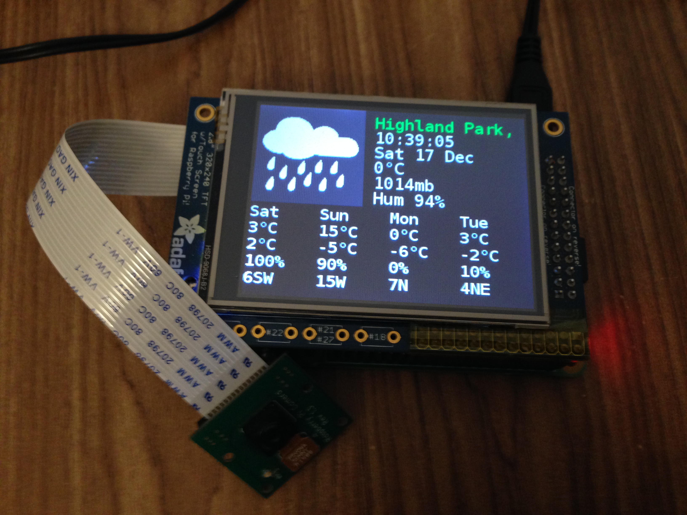

# pi-dashboard
A dashboard for Raspberry Pi to provide various information on PiTFT LCD screen. 

## Weather 

The program displays on PiTFT some basic weather information, such as temperature, humidity, wind velocity, etc. for current time, and forecast for the next few days. 

Almost all of the code was taken from [jacotronix's PiTFT Weather Station Github repo](https://github.com/jacotronix/net.jacotronix.python.PiTFTWeather). I modified it to display information I need, and als added some hack to deal with KeyboardInterrupt error of PiTFT.

See more info about the bug here: http://stackoverflow.com/questions/17035699/pygame-requires-keyboard-interrupt-to-init-display

## How to run 

```sh
$ sudo ./main.py & # need to be root, and run in background mode.
```

## Demo 



